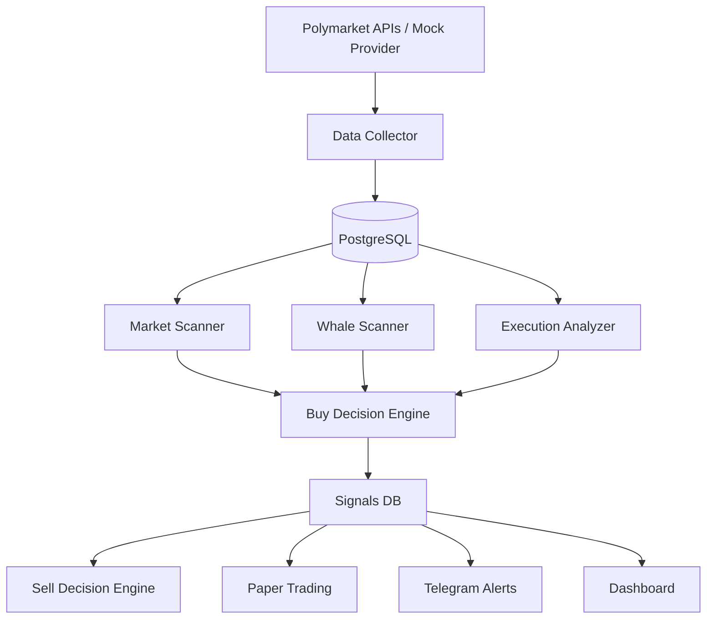

# Polymarket Signal Lab - Phase 1

Local infrastructure to identify what to buy and when to sell on Polymarket using market signals, whale activity, scoring, paper trading, and alerts.

> This phase does **not** execute real buy/sell actions. No private keys are used. No orders are placed. It is designed for research, validation, paper trading, and manual micro-live trading.

## Objective

The project answers two questions:

1. **What to buy?** via `Buy Decision Engine`.
2. **When to sell?** via `Sell Decision Engine`.

The strategy combines:

```text
Market Signal
+ Whale Confirmation
+ Execution Quality
= BUY_WATCH / STRONG_BUY_WATCH
```

Exit conditions:

```text
Whales reducing
OR Market score invalidated
OR Stop loss
OR Take profit
OR Max holding time
= SELL_WATCH
```

## Stack

- Backend: Node.js + TypeScript + Express
- DB: PostgreSQL
- Optional cache/queue: Redis
- Worker: Node.js cron loop
- Frontend: React + Vite
- Alerts: Optional Telegram Bot
- Demo mode: mock data included

## Architecture



## Quick start with Docker

```bash
cp .env.example .env
docker compose up --build
```

Services:

- API: http://localhost:8081
- Frontend: http://localhost:5173
- PostgreSQL: localhost:5432

Health check:

```bash
curl http://localhost:8081/health
```

Run one manual signal cycle:

```bash
curl -X POST http://localhost:8081/api/signals/run
```

View signals:

```bash
curl http://localhost:8081/api/signals/latest
```

## Local setup without Docker

```bash
cd backend
npm install
cp ../.env.example .env
npm run migrate
npm run dev
```

In another terminal:

```bash
cd frontend
npm install
npm run dev
```

## Environment variables

See `.env.example`.

Default:

```env
DATA_MODE=mock
```

For live APIs, set:

```env
DATA_MODE=live
```

Real providers are under `backend/src/providers/polymarket`. Endpoints are configurable to simplify tuning.

## Main endpoints

```text
GET  /health
GET  /api/markets/hot
GET  /api/markets/:id
GET  /api/wallets/top
GET  /api/wallets/:address
GET  /api/signals/latest
GET  /api/signals/open
GET  /api/signals/:id
POST /api/signals/run
GET  /api/paper-trades/performance
POST /api/paper-trades/open/:signalId
POST /api/paper-trades/close/:signalId
```

## Initial rules

Configured in `backend/src/config/strategy.ts`.

### Buy

```yaml
minMarketScore: 70
minWhaleScore: 75
minExecutionScore: 70
minWalletsConfirming: 2
maxSpread: 0.03
maxPriceChase: 0.05
minLiquidityUsd: 25000
minVolume24hUsd: 50000
```

### Sell

```yaml
stopLossPct: 0.15
takeProfit1Pct: 0.25
takeProfit2Pct: 0.45
exitIfMarketScoreBelow: 50
exitIfSpreadAbove: 0.05
exitIfWhalesReducing: true
maxHoldHours: 24
```

## Recommended Phase 1 workflow

1. Start the system in mock mode.
2. Run `POST /api/signals/run`.
3. Review dashboard and signals.
4. Enable Telegram if you want alerts.
5. Switch to `DATA_MODE=live` once live endpoints are validated.
6. Collect 100-300 signals before using real money.
7. In micro-live, buy/sell manually with small amounts.

## Security

- No private keys.
- No real CLOB execution.
- No auto-buy or auto-sell.
- Signals are for manual review.
- Exit logic is used for alerts and paper trading only.

## Next steps

- Connect real Polymarket Data API for trades/holders.
- Add The Graph / Bitquery for on-chain validation.
- Improve wallet PnL calculation.
- Add historical backtesting.
- Add authentication if moving to SaaS.
- Add optional Falcon API / Apify provider integrations.
